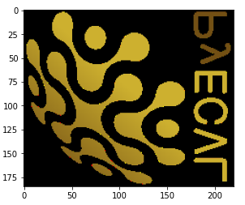
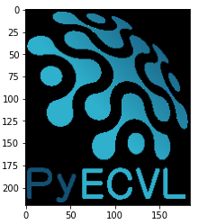

.. _getting_started:

Getting Started
===============

This section contains some PyECVL coding examples. Refer to the :ref:`API docs
<ecvl>` for additional details. You can find more examples in the ``examples``
directory of the `GitHub repo <https://github.com/deephealthproject/pyecvl>`_.

Creating an image
-----------------

Create an empty image:

.. code-block:: python

    import pyecvl.ecvl as ecvl
    img = ecvl.Image.empty()

Create an uninitialized image with ``uint8`` data type, ``"xyc"`` plane layout
(horizontal, vertical and color dimension) and ``BGR`` color type:

.. code-block:: python

    import pyecvl.ecvl as ecvl
    dims = [20, 40, 3]  # [x, y, c] dimensions
    img = ecvl.Image(dims, ecvl.DataType.uint8, "xyc", ecvl.ColorType.BGR)

Read an image from a file:

.. code-block:: python

    import pyecvl.ecvl as ecvl
    img = ecvl.ImRead("sample.png")

To/from NumPy conversions
-------------------------

Create an image with data initialized from a NumPy array:

.. code-block:: python

    import pyecvl.ecvl as ecvl
    import numpy as np
    a = np.arange(12).reshape(3, 4).astype(np.int16)
    img = ecvl.Image.fromarray(a, "xy", ecvl.ColorType.GRAY)

Convert an image to a NumPy array:

.. code-block:: python

    import pyecvl.ecvl as ecvl
    import numpy as np
    img = ecvl.ImRead(img_path)
    a = np.array(img)

You can also do ``a = np.array(img, copy=False)`` to view the image data as an
array without copying the data.

NumPy compatibility allows to perform a wide range of operations on images,
some of which are implemented by dedicated methods in the C++ API. For
instance, to set all image elements to a value (``SetTo`` in C++):

.. code-block:: python

    import pyecvl.ecvl as ecvl
    import numpy as np
    img = ecvl.ImRead(img_path)
    a = np.array(img, copy=False)
    a.fill(100)
    ecvl.ImWrite("filled.png", img)

To slice an image:

.. code-block:: python

    import pyecvl.ecvl as ecvl
    import numpy as np
    img = ecvl.ImRead(img_path)
    a = np.array(img, copy=False)[:256, :256, :]
    sliced = ecvl.Image.fromarray(a, img.channels_, img.colortype_)
    ecvl.ImWrite("sliced.png", sliced)

One thing to note in case you want to display the numpy array as an image, is
that typical Python frameworks capable of displaying images expect a ``yxc``
dimension layout and RGB color mode, while images read by ECVL -- by default
-- have an ``xyc`` layout and BGR color mode. So, if you display the array as
an image (for instance, with matplotlib's ``imshow`` on Jupyter) you might get
odd results:

.. code-block:: python

    import matplotlib.pyplot as plt
    import pyecvl.ecvl as ecvl
    import numpy as np
    logo_img = ecvl.ImRead("/usr/local/src/pyecvl/docs/logo.png")
    plt.imshow(np.array(logo_img))

To avoid this, change the channels layout and color mode before converting the
image to an array:

.. code-block:: python

    logo_img_mod = ecvl.Image.empty()
    ecvl.ChangeColorSpace(logo_img, logo_img_mod, ecvl.ColorType.RGB)
    ecvl.RearrangeChannels(logo_img_mod, logo_img_mod, "yxc")
    plt.imshow(np.array(logo_img_mod))

Image processing
----------------

Read an image from a file, apply some transformations and save it to another
file:

.. code-block:: python

    import pyecvl.ecvl as ecvl
    img = ecvl.ImRead("sample.png")
    tmp = ecvl.Image.empty()
    ecvl.Rotate2D(img, tmp, 60)  # rotate by 60 degrees
    gamma = 3
    ecvl.GammaContrast(tmp, tmp, gamma)  # adjust contrast
    ecvl.ImWrite("sample_mod.png", tmp)

You can also apply custom transformations via NumPy. For instance:

.. code-block:: python

    import pyecvl.ecvl as ecvl
    import numpy as np

    def inc_brightness(img, rate):
        a = np.array(img, copy=False)
        max_val = np.iinfo(a.dtype).max
        a[a > max_val - rate] = max_val
        a[a <= max_val - rate] += rate

    img = ecvl.ImRead("sample.png")
    inc_brightness(img, 10)
    ecvl.ImWrite("sample_mod.png", img)
